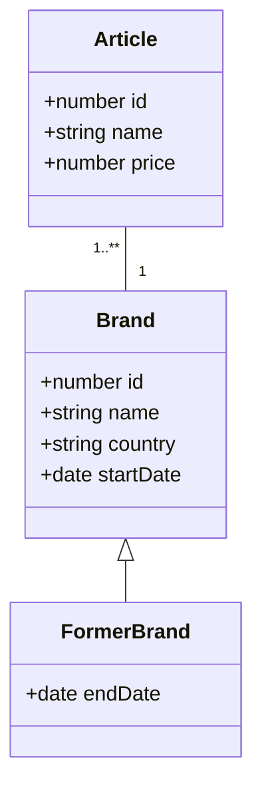

# Ember Data Polymorphic issue in v4.12

This project is a proof a concept to demonstrate polymorphism issues with RESTAdapter in Ember-Data 4.12.
It has been designed only for support purpose.

## Prerequisites

You will need the following things properly installed on your computer.

* [Git](https://git-scm.com/)
* [Node.js](https://nodejs.org/)
* [Yarn](https://yarnpkg.com/)
* [Ember CLI](https://cli.emberjs.com/release/)

## Installation

* `git clone <repository-url>` this repository
* `cd ember-data-polymorphic`
* `yarn`

## Running / Development

* `yarn serve:stack`
* Visit your app at [http://localhost:4200](http://localhost:4200).
* Query your backend at [http://localhost:3000](http://localhost:3000).

### Reproduction steps

Once the app is running, go on the [app homepage](http://localhost:4200) and click twice on the "Zune 30".  
Open your console to see the error.

### Data models

